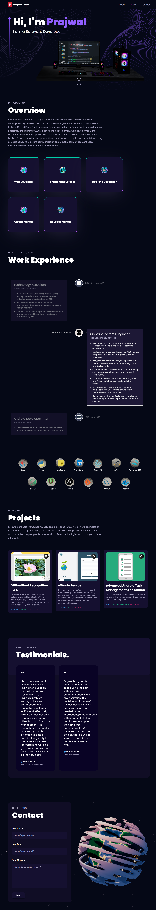

# My Portfolio Website

This is my personal portfolio website built using **Vite.js**, **TypeScript**, and **Three.js**. It showcases my projects, skills, and experience with interactive 3D animations and models.

## Features

- Fully responsive design
- Interactive 3D animations and models powered by Three.js
- Smooth navigation and performance-optimized using Vite.js
- Built with TypeScript for type safety and maintainability

## Technologies Used

- **Vite.js** – Fast and modern build tool
- **TypeScript** – Strongly typed JavaScript
- **Three.js** – 3D animations and interactive models
- **CSS / Tailwind CSS** (if used) – Styling

## Installation

# Clone the repository:

```bash
git clone https://github.com/your-username/your-portfolio.git
cd your-portfolio
```

# Install dependencies:

```bash
npm install
```

# Starting the development server

```bash
npm run dev
```

# Build

```bash
npm run build
```

# Screenshots / Demo

